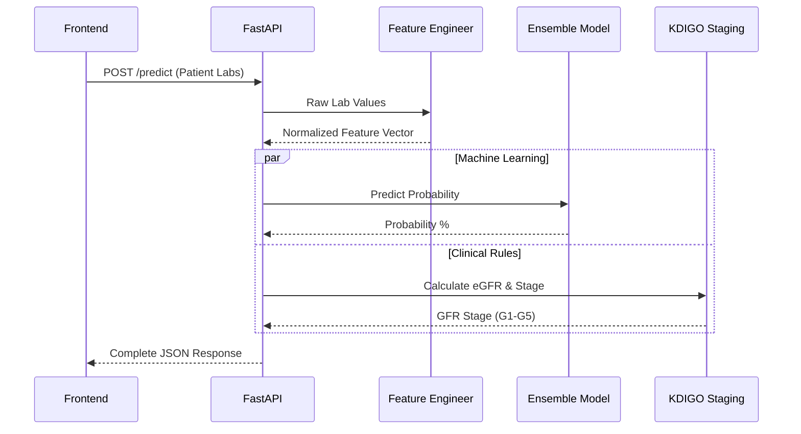
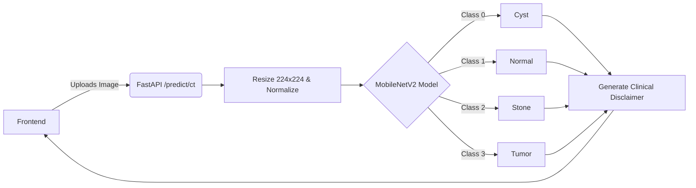
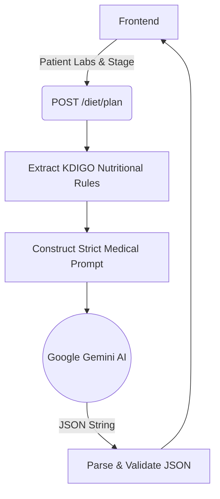
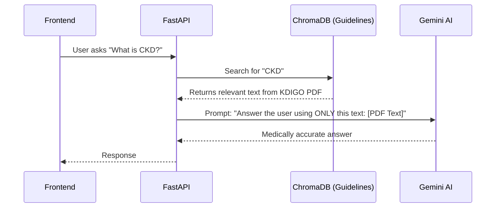

<div align="center">
  
  <h1>Kidnefy-AI: Ultimate Developer & Frontend Guide</h1>
  <p><strong>The Complete Engineering Manual for the Kidnefy-AI Medical Platform</strong></p>

  [](https://fastapi.tiangolo.com/)
  [](https://www.python.org/)
  [](https://www.tensorflow.org/)
  [](https://aistudio.google.com/)
</div>

---

## 🛑 STOP! Read This First (For The Team)
This document contains **everything** you need to know about how the backend works, how the AI models are integrated, and exactly how the Frontend should call the APIs. If you have a question about an endpoint, a payload, or how a feature works, **it is answered here.**

---

## 🌟 The 9 Core AI Engines

Kidnefy-AI is a full **Clinical Decision Support System (CDSS)** equipped with 9 major AI engines:

1. 🧠 **ML/DL Prediction Ensemble**: Predicts CKD with 97% accuracy using XGBoost, RF, SVM, and Deep Learning.
2. 📊 **Clinical Staging Engine**: Calculates eGFR and classifies patients into KDIGO stages (G1-G5).
3. 🩺 **RAG Medical Chatbot**: A Gemini-powered assistant that reads KDIGO guidelines and answers patient questions.
4. ⚖️ **What-If Simulator**: Simulates treatment plans to show how risk probability drops if the patient improves their labs.
5. 🚨 **Smart Alerts & Monitoring**: Tracks patient history using Machine Learning (Isolation Forest) to detect "Fast Progressors".
6. 📄 **Medical Reports**: Generates print-ready HTML/PDF bilingual reports.
7. 🥗 **Smart Diet Planner**: Generates a 7-day personalized meal plan based on KDIGO rules and the patient's specific lab results.
8. 🔬 **CT Image Classification**: A CNN model (MobileNetV2) that analyzes kidney CT scans to detect Normal, Cyst, Stone, or Tumor.

---

## 🏛️ 1. Master System Architecture

This diagram shows how all components connect. The Frontend ONLY talks to the FastAPI Backend.

```mermaid
graph TD
    Client["Frontend Dashboard (React/Vue/HTML)"]
    API["FastAPI Backend (api.py)"]
    
    submap CoreModules ["Core AI & Clinical Modules"]
        Staging["Staging Engine (KDIGO)"]
        Prediction["Prediction Ensemble (XGBoost + DL)"]
        RAG["Medical Chatbot (Gemini RAG)"]
        Diet["Smart Diet Planner (Gemini)"]
        Monitoring["Smart Alerts & Monitoring"]
        Reports["Report Generator (HTML)"]
        CTVision["CT Image Classifier (CNN)"]
    end
    
    Client -->|REST API Calls| API
    
    API -->|"/stage"| Staging
    API -->|"/predict & /predict/whatif"| Prediction
    API -->|"/chat"| RAG
    API -->|"/diet/plan"| Diet
    API -->|"/alerts/*"| Monitoring
    API -->|"/report"| Reports
    API -->|"/predict/ct"| CTVision
```

---

## 🔄 2. Detailed Workflows (How Things Work)

### A. The Prediction & What-If Flow
How the backend calculates the final risk percentage.


### B. CT Image Classification Flow
How the Deep Learning vision model processes x-rays.


### C. Smart Diet Planner Flow
How the AI generates a customized meal plan safely.


### D. RAG Chatbot Flow
How the Chatbot knows medical guidelines without hallucinating.


---

## 🚀 3. Setup & Installation (For Backend Devs)

We have created an automated setup script to make running the project as easy as possible.

1. **Clone the repo** (Make sure Git LFS is installed for the model weights):
   ```bash
   git lfs install
   git clone https://github.com/amribrahim11vv/Kidnefy-Ai.git
   cd Kidnefy-Ai
   ```
2. **Run the Automated Setup (Windows)**:
   Simply double-click on the `setup_and_run.bat` file in the root directory. This script will automatically:
   - Create a virtual environment (`.venv`)
   - Install all Python dependencies
   - Create a `.env` file (if missing)
   - Start the FastAPI server on `http://127.0.0.1:8000/docs`

3. **Manual Setup (Mac/Linux)**:
   ```bash
   python -m venv .venv
   source .venv/bin/activate
   pip install -r requirements.txt
   cp .env.example .env
   # Edit .env and add your GEMINI_API_KEY
   uvicorn api:app --host 0.0.0.0 --port 8000 --reload
   ```

---

## 📡 4. Ultimate Frontend Integration Guide (API Reference)

Frontend Developers: Use these exact `fetch` templates to connect the UI to the Backend.
All endpoints are located at `http://localhost:8000`.

### 1. Predict CKD (The Main Form)
**Endpoint**: `POST /predict`
```javascript


### 3. Smart Diet Planner (7-Day Plan)
**Endpoint**: `POST /diet/plan`
```javascript
const response = await fetch('http://localhost:8000/diet/plan', {
  method: 'POST',
  headers: { 'Content-Type': 'application/json' },
  body: JSON.stringify({
    age: 60,
    weight_kg: 85,
    ckd_stage: "G3b",
    potassium_level: 5.2, // High potassium triggers strict rules!
    phosphorus_level: 4.5,
    has_diabetes: true
  })
});
const result = await response.json();
// result.diet_plan.days -> Array of 7 days with meals
// result.diet_plan.nutritional_targets.daily_calories
```

### 4. Medical Chatbot (RAG)
**Endpoint**: `POST /chat`
```javascript
const response = await fetch('http://localhost:8000/chat', {
  method: 'POST',
  headers: { 'Content-Type': 'application/json' },
  body: JSON.stringify({ question: "كيف اقلل البوتاسيوم في الاكل؟" })
});
const result = await response.json();
// result.answer -> text response in Arabic
```

### 5. What-If Simulator (Compare Two Plans)
**Endpoint**: `POST /predict/whatif`
```javascript
const response = await fetch('http://localhost:8000/predict/whatif', {
  method: 'POST',
  headers: { 'Content-Type': 'application/json' },
  body: JSON.stringify({
    baseline: { age: 60, sex: "male", sc: 2.5, bp: 160, al: 2, dm: "no" }, // Current state
    modified: { age: 60, sex: "male", sc: 1.8, bp: 125, al: 0, dm: "no" }  // If patient improves
  })
});
const result = await response.json();
// result.simulation_results.risk_reduction_percentage -> 45.2
```

---

## 📁 5. Folder Structure Explained

```text
kidney_disease_prediction/
|-- api.py                    <- The Brain. Contains all FastAPI endpoints.
|-- setup_and_run.bat         <- Automated one-click setup script for Windows.
|-- config.py                 <- Central configuration and paths.
|-- .env                      <- Put your API keys here.
|-- requirements.txt          <- Python libraries.
|
|-- docs/                     <- Comprehensive Team Documentation
|   |-- TEAM_ONBOARDING_GUIDE.md <- Ultimate guide for new developers
|   +-- CODEBASE_MAP.md       <- Detailed index of what every file does
|
|-- models/                   <- AI Models Folder
|   |-- kidney_ct_classifier.keras <- The Deep Learning CT Model (24MB)
|   |-- staging/              <- XGBoost Models
|   +-- evaluation/           <- Accuracy charts and Confusion Matrices
|
|-- src/                      <- Source Code
|   |-- imaging/              <- CT Scan processing scripts
|   |-- rag/                  <- Chatbot & ChromaDB scripts
|   |-- staging/              <- KDIGO mathematical formulas
|   |-- preprocessing/        <- Data cleaning scripts
|
|-- scripts/                  <- Development & Training Scripts
|   |-- train_ultrasound.py   <- Scripts used for ML training
|   +-- evaluate_ct_model.py  <- Evaluation and metrics generation
```

---

## 📊 6. AI Models Performance

If Dr. / Professors ask about the accuracy during the presentation, show them this:

| Model | Technology | Accuracy |
|---|---|---|
| **CKD Prediction** | XGBoost / Ensemble | **98.52%** |
| **CT Scan Classification** | MobileNetV2 (Transfer Learning) | **83.40%** |
| **Chatbot** | Gemini 2.5 Flash + RAG (ChromaDB) | Context-Aware |
| **Diet Planner** | Gemini 2.5 Flash + JSON Parsing | Rule-Strict |

---
**Developed by the Kidnefy-AI Graduation Project Team — 2026.**
