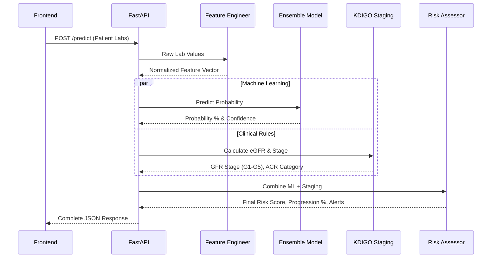
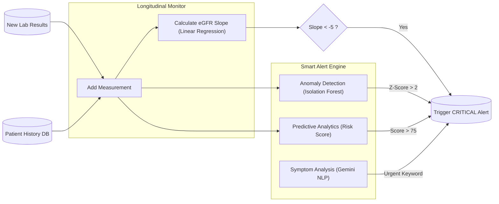

# Kidnefy-AI Architecture Documentation

This document provides a high-level overview of the Kidnefy-AI system architecture, data flows, and core modules. It is designed to help new developers understand how the frontend, API, and AI modules interact.

---

## 1. High-Level System Architecture

The project is built around a robust FastAPI backend that orchestrates multiple AI and clinical rule-based engines.

```mermaid
graph TD
    %% Define Nodes
    Client["Frontend Dashboard (HTML/JS)"]
    API["FastAPI Backend (api.py)"]
    
    submap CoreModules ["Core AI & Clinical Modules"]
        Staging["Staging Engine (KDIGO)"]
        Prediction["Prediction Ensemble (XGBoost + DL)"]
        OCR["OCR Engine (EasyOCR)"]
        RAG["Medical Chatbot (Gemini RAG)"]
        Diet["Smart Diet Planner (Gemini AI)"]
        Monitoring["Smart Alerts & Monitoring"]
        Reports["Report Generator (HTML/PDF)"]
        CTVision["CT Image Classifier (MobileNetV2)"]
    end
    
    %% Define Relationships
    Client -->|REST API Calls| API
    
    API -->|"/stage"| Staging
    API -->|"/predict & /predict/whatif"| Prediction
    API -->|"/predict/image"| OCR
    API -->|"/chat"| RAG
    API -->|"/diet/plan"| Diet
    API -->|"/alerts/*"| Monitoring
    API -->|"/report"| Reports
    API -->|"/predict/ct"| CTVision
    
    %% Cross-module communications
    Prediction --> Staging
    Monitoring --> Staging
    RAG -.->|"Patient Context"| Monitoring
```

---

## 2. Prediction & What-If Flow

When a patient's data is submitted for prediction or what-if simulation, it passes through multiple layers to ensure medical accuracy.



---

## 3. Smart Alerts & Longitudinal Monitoring

This system tracks a patient's health over time and uses Machine Learning to detect sudden anomalies or rapid decline.



---

## Technical Stack Summary

*   **Backend Framework:** FastAPI (Python)
*   **Machine Learning:** XGBoost, TensorFlow/Keras, Scikit-learn (Isolation Forest)
*   **Clinical Rules:** KDIGO 2012 Guidelines (CKD-EPI equation)
*   **Generative AI:** Google Gemini (RAG, Symptom Analysis)
*   **OCR:** EasyOCR / Tesseract
*   **Vector DB:** ChromaDB (for medical knowledge base)
