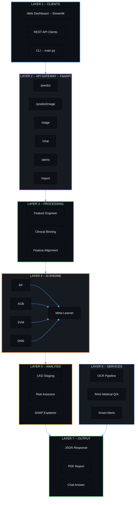
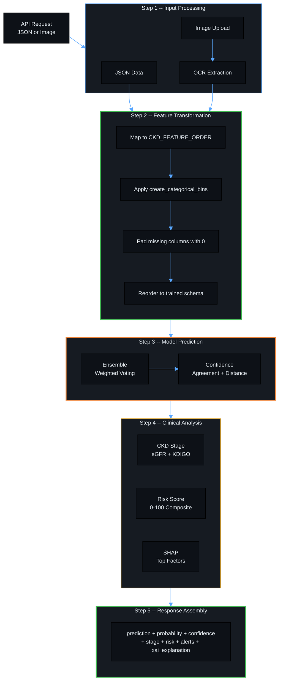
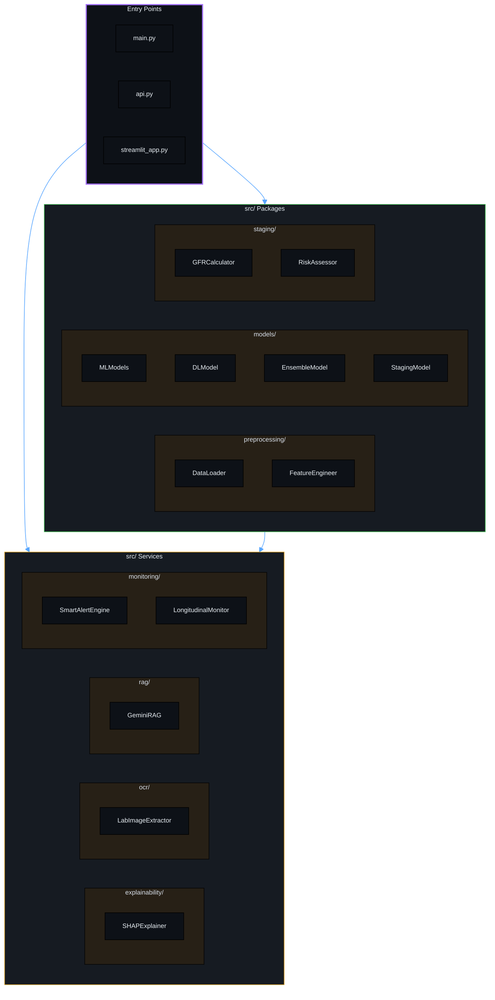

# Kidney Disease Prediction System -- Architecture

---

## 1. System Overview (Layered Architecture)

---

## 2. Training Pipeline (Offline)

```mermaid
%%{init: {'theme': 'base', 'themeVariables': { 'primaryColor': '#0d1117', 'primaryTextColor': '#e6edf3', 'lineColor': '#58a6ff', 'fontSize': '12px'}, 'flowchart': {'rankSpacing': 40}}}%%

flowchart LR
    A["Raw Datasets\n3 CSV/XLSX"] --> B["DataLoader\nMerge + Clean"]
    B --> C["Imputation\nKNN k=5"]
    C --> D["Encoding\nLabel + Scale"]
    D --> E["Clinical Binning\n6 features x 4 bins"]
    E --> F["One-Hot Encoding\ndrop_first"]
    F --> G["Interaction Features\nRatios + Products"]
    G --> H["Feature Selection\nSelectKBest + PCA"]
    H --> I["Split\n80/20 Stratified"]
    I --> J["Train 4 Models\nRF + XGB + SVM + DNN"]
    J --> K["Meta-Learner\n5-Fold Stacking"]
    K --> L["Save Models\n+ Feature Names"]

    style A fill:#161b22,stroke:#58a6ff,stroke-width:1px,color:#e6edf3
    style E fill:#161b22,stroke:#3fb950,stroke-width:2px,color:#e6edf3
    style F fill:#161b22,stroke:#3fb950,stroke-width:2px,color:#e6edf3
    style J fill:#161b22,stroke:#f0883e,stroke-width:2px,color:#e6edf3
    style K fill:#161b22,stroke:#f0883e,stroke-width:2px,color:#e6edf3
    style L fill:#161b22,stroke:#d29922,stroke-width:2px,color:#e6edf3
```

---

## 3. Inference Pipeline (Real-Time)

---

## 4. Module Map

---

## 5. Technology Stack

| Layer | Technology | Purpose |
|---|---|---|
| API | FastAPI + Uvicorn | Async REST with Swagger |
| ML | Scikit-learn, XGBoost | RF, SVM, Gradient Boosting |
| DL | TensorFlow / Keras | Neural Network |
| OCR | EasyOCR | Lab report text extraction |
| RAG | Gemini + ChromaDB | Medical Q/A |
| XAI | SHAP | Feature attribution |
| Reports | FPDF | PDF generation |
| Data | Pandas, NumPy | ETL + feature engineering |
| Deploy | Docker Compose | Containerization |
| UI | Streamlit | Web dashboard |
